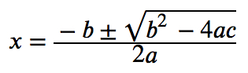

# Math
이 장에 관심이 있다면 논문, 학술자료, 공학, 교사에 관련된 직업일 확률이 높습니다.
글 또는 그림과 다르게 수학 기호와 수식은 그래프의 표현은 책을 집필할 때 어려움이 됩니다. 이 상황에서 Latex를 사용하면 유용합니다.
이 책은 LaTex, WebTex, MathML을 소개합니다. LaTex를 심도있게 다루고 나머지 솔루션은 소개정도만 다룹니다.
그럼 문서를 생성할 때 어떻게 수학의 기호나 그래프를 그리는지 알아보겠습니다.

## LaTex
LaTex는 오픈소스 조판시스템(Typesetting System)입니다.
조판작업이란 최종 결과물이 출력이 되기전에 출력될 결과물에 맞게 도형,수식,글을 배치하는 작업입니다.
LaTex를 이용해서 모든 형태를 그리고 배치할 수 있지만 대부분 수식, 그래프 작업이 필요할 때 일반적으로 많이 사용합니다.
또한 물리학자들을 위한 학술 커뮤니케이션 언어로 많이 사용됩니다. 어렵고 이상해 보이지만 35년이상 사용되면서 필요한 표기를 잘 처리할 수 있었습니다.
수식을 표현하는 솔루션은 LaTex, WebTex, MathML .. 등등 굉장히 많습니다.
수식을 모든 문서에 표기하기 위해서는 비효율적이지만 LaTex문법을 이용해서 이미지로 렌더링 후 문서에 첨부하는 형태입니다.
불편해보이지만 다른 포멧으로 컨버팅 되더라도 문제없이 표시되기 때문입니다.

### LaTex 설치
macOS는 용량이 크지만 macTex를 설치하시면 설치 솔루션을 한번에 해결할 수 있습니다.
MacTex 설치후 LaTexIt을 이용하면 미리결과를 보면서 LaTex문법을 타이핑할 수 있습니다.
또한 추후 재사용할 수 있도록 tex파일로 저장할 수 있습니다.

- 다운로드사이트 : http://www.tug.org/mactex/mactex-download.html

### LaTex문법
이 챕터에서는 LaTex의 문법을 배워보겠습니다.

#### 4칙연산

#### 분수의 표기

#### 찾아보기

#### LaTex 참고자료
아래 링크를 참고하시면 더 많은 LaTex정보를 보실 수 있습니다.

- LaTex 문법을 쉽게 익힐 수 있는 곳은 아래 사이트입니다.
	https://en.wikibooks.org/wiki/LaTeX/Mathematics

- LaTex를 이용해서 많은것을 그릴 수 있습니다. 아래 URL에서 구경해보세요.
	https://en.wikibooks.org/wiki/LaTeX/Picture

## WebTex
LaTex는 종이 인쇄물 기반의 기술입니다. 현대 과학의 대부분의 정보는 Web으로 표기됩니다.
WebTex 프로젝트는 LaTex를 html문서로 문제없이 컴파일 하는 것을 목표로 두고 있습니다.
문법은 LaTex와 거의 같습니다. epub 만을 제작하는 상황이라면 WebTex를 사용하는것은 좋은 방법입니다.
만약 여러분이 마크다운에서 WebTex 문법을 사용했다면 epub 파일을 제작할 때 아래 옵션을 추가해주면 됩니다.

	--webtex

WebTex 문법은 $ 수식 $ 형태로 구성되어 있습니다.

    $f(x)=\sum_{n=0}^\infty\frac{f^{(n)}(a)}{n!}(x-a)^n$

위 문장이 문제없이 잘 처리되었다면 아래와 같은 수식이 그려집니다.

#### 참고자료
- 프로젝트 사이트 : [http://pkgw.github.io/webtex/](http://pkgw.github.io/webtex/)
- 프로젝트 코드 : [https://github.com/pkgw/webtex/](https://github.com/pkgw/webtex/)

## MathML
Mathematical Markup Language의 약자입니다.
epub3 에서 수학기호를 표현하는 방법중 하나입니다.
XML 용용기술이며, HTML5 기술의 하나입니다.
개인적으로 LaTex문법이 짧고 함축적이고 가독성이 더 좋다고 생각합니다.
MathML은 여러분이 사용하는 브라우저가 지원할 수도 있고 지원하지 않을수도 있습니다.
브라우저에 따라 결과가 다를 수 있습니다.
파이어폭스, 사파리에서는 정상적으로 값이 출력되지만, 크롬에서는 아직 지원이 되지 않습니다.

#### MathML의 작성

위 수식에 해당하는 MathML의 문법입니다.

    <math>
    <mi>x</mi>
    <mo>=</mo>
    <mfrac>
      <mrow>
      <mrow>
        <mo>-</mo>
        <mi>b</mi>
      </mrow>
      <mo>&PlusMinus;</mo>
      <msqrt>
        <msup>
        <mi>b</mi>
        <mn>2</mn>
        </msup>
        <mo>-</mo>
        <mrow>
        <mn>4</mn>
        <mo>&InvisibleTimes;</mo>
        <mi>a</mi>
        <mo>&InvisibleTimes;</mo>
        <mi>c</mi>
        </mrow>
      </msqrt>
      </mrow>
      <mrow>
      <mn>2</mn>
      <mo>&InvisibleTimes;</mo>
      <mi>a</mi>
      </mrow>
    </mfrac>
    </math>